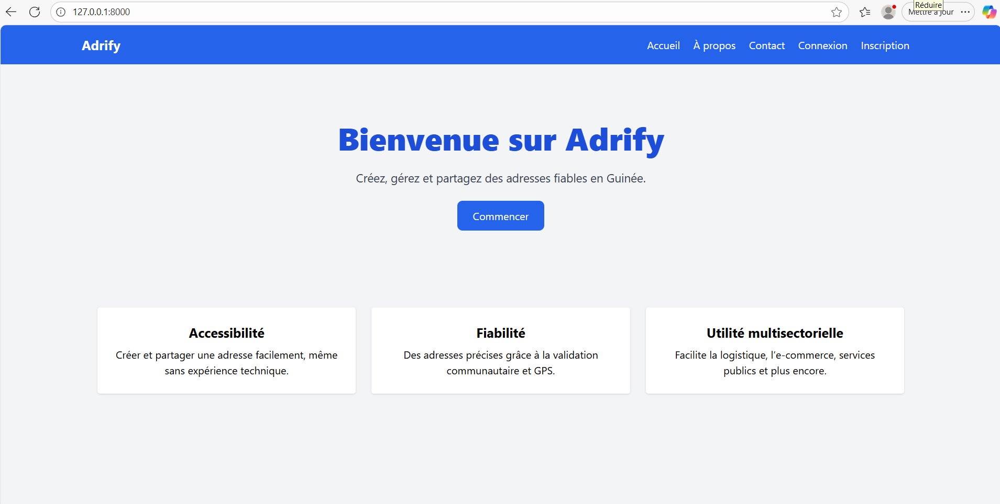
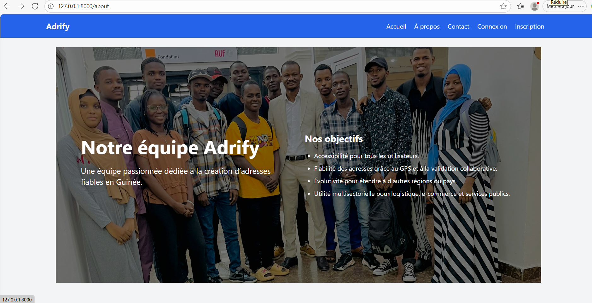

# Adrify - Gestion d'adresses et partages


**Adrify** est une application web Laravel permettant aux utilisateurs de gérer leurs adresses, partager des liens ou QR codes, et suivre des validations.  

---

## ⚙️ Fonctionnalités principales

- Gestion des adresses (CRUD)
- Partage d’adresses via lien ou QR code
- Historique des partages
- Gestion des validations (pour les administrateurs)
- Tableau de bord personnalisé selon le rôle (user/admin)
- Gestion des signalements

---

## 📸 Captures d’écran

**Page d'acceuil grand public**  


**Page à propos grand public**  



## 1️⃣ Administrateur (Admin)

- L’administrateur a le contrôle complet sur l’application. Ses fonctions incluent :

- Gérer tous les utilisateurs (créer, éditer, supprimer, consulter).

- Gérer toutes les adresses de la plateforme.

- Consulter et gérer toutes les validations faites par les validateurs.

- Gérer tous les partages et les historiques de partage.

- Consulter les signalements des utilisateurs et prendre les actions nécessaires.

- Accéder à un tableau de bord complet avec toutes les statistiques de la plateforme.
**Dashboard administrateur**  


## 2️⃣ Validateur

Le validateur est un utilisateur spécialisé dont le rôle est de vérifier et valider certaines actions ou contenus créés par les utilisateurs. Ses fonctions :

- Consulter les adresses à valider.

- Valider ou rejeter les adresses ou actions selon les critères définis.

- Suivre l’historique des validations effectuées.

- Accéder à un tableau de bord dédié pour suivre les validations en attente ou terminées.
**Dashboard Validateur**  


## 3️⃣ Utilisateur (User)

L’utilisateur est le rôle classique pour les personnes utilisant la plateforme pour gérer leurs propres informations. Ses fonctions :

- Créer, modifier et supprimer ses adresses.

- Partager ses adresses via liens ou QR codes.

- Consulter l’historique de ses partages.

- Signaler des adresses ou contenus problématiques.

- Accéder à un tableau de bord personnel avec ses statistiques (nombre d’adresses, partages et signalements).

**Dashboard utilisateur**  


> Pour insérer une capture, crée un dossier `screenshots` dans ton projet et ajoute tes images dedans.

---

## 🛠 Installation et configuration

1. Cloner le dépôt :  
```bash
git clone https://github.com/Tamba-R/ODC_Adrify.git
cd adrify

2. Installer les dépendances PHP :
```bash
composer install

3. Copier le fichier .env et générer la clé :
```bash
cp .env.example .env
php artisan key:generate

4. Configurer la base de données dans .env

5. Lancer les migrations :
php artisan migrate

6. Lancer le serveur local :
php artisan serve

