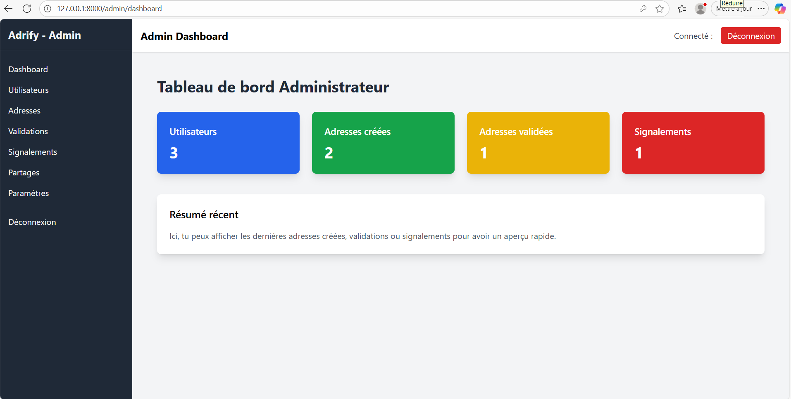
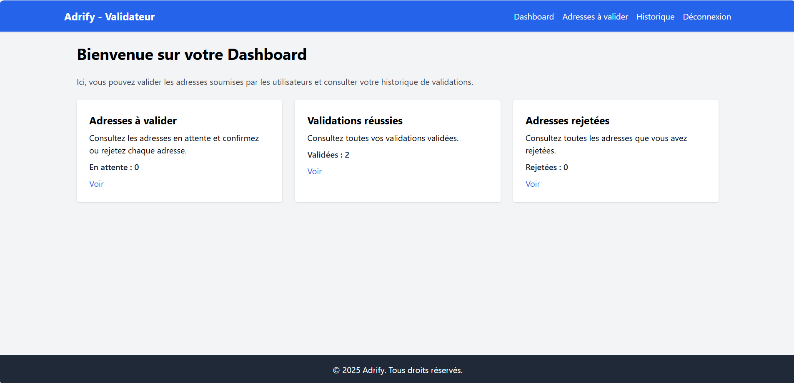

# Adrify - Gestion d'adresses et partages

**Adrify** est une application web Laravel permettant aux utilisateurs de gérer leurs adresses, partager des liens ou QR codes, et suivre des validations.  

---

## ⚙️ Fonctionnalités principales

- Gestion des adresses (CRUD)
- Partage d’adresses via lien ou QR code
- Historique des partages
- Gestion des validations (pour les administrateurs)
- Tableau de bord personnalisé selon le rôle (user/admin)
- Gestion des signalements

---

## 📸 Captures d’écran

**Dashboard utilisateur**  


**Dashboard Validateur**  


**Dashboard administrateur**  


> Pour insérer une capture, crée un dossier `screenshots` dans ton projet et ajoute tes images dedans.

---

## 🛠 Installation et configuration

1. Cloner le dépôt :  
```bash
git clone https://github.com/ton-user/adrify.git
cd adrify
